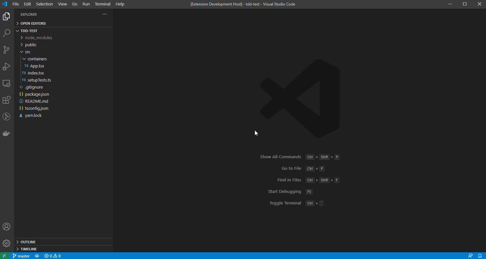

# TDD Zen

TDD Zen is a simple extension for keep in the screen code files and it's corresponding test files.

## Features

Ispired by TDD/BDD aproach it creates a Jest like folder structure.

- Creates and brings up in splited editor a test file for the current focused code file.
- Renames or deletes the test file when anchor code file status is modified.

## Setup

No setup needed for the moment. Extension loads on `Startup Finished`

## Example

